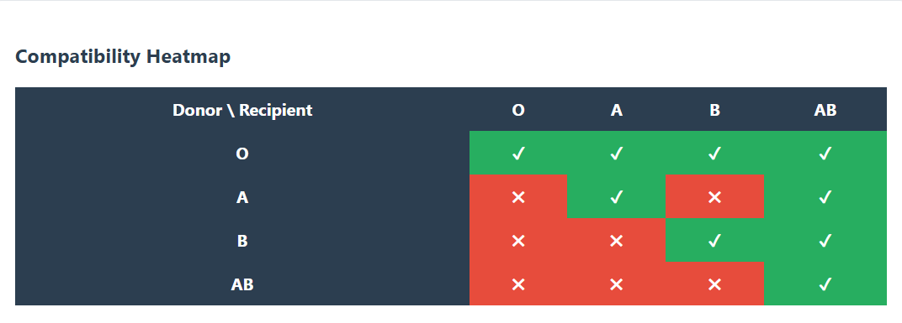

# TVIP – Transfusion Validation Intelligence Platform

A clinical validation simulation platform designed to demonstrate automated validation workflows for **Blood Bank / BECS systems** used in hospital LIS and EHR implementations.

This system models how clinical data validation pipelines evaluate transfusion compatibility and generate certification reports for compliance environments.

---

## Key Features

• Blood compatibility validation engine
• Risk distribution analytics 
• Validation audit log 
• Clinical validation dashboard 
• QR-based certificate verification 
• Automated validation report generation

---

## System Architecture

Laboratory Information System (LIS)
        │
        ▼
Blood Compatibility Engine
        │
        ▼
Validation Rule Processor
        │
        ▼
Risk Scoring Analytics
        │
        ▼
Clinical Certification Output
        │
        ▼
Validation Dashboard

### Components

Backend
- Python
- FastAPI validation engine
- Compatibility rule processor

Frontend
- HTML / CSS
- JavaScript
- Chart.js analytics dashboards

Compliance Context
- AABB Blood Bank Standards
- FDA 21 CFR Part 11
- Joint Commission Accreditation
- CLIA Laboratory Compliance

## Dashboard Screenshots

### Validation Dashboard

### Blood Compatibility Heatmap

### Risk Distribution Analytics

## How to Run the Platform

Clone the repository:

git clone https://github.com/medlabtech2013/tvip-becs-validation-platform.git
cd tvip-becs-validation-platform

Install dependencies:

pip install -r requirements.txt

Start the server:

uvicorn app.main:app --reload

Open dashboard:

http://127.0.0.1:8001/dashboard

Purpose
This project demonstrates how automated validation tooling can support clinical system validation workflows during Blood Bank system implementation.

Author
Branden Bryant

Medical Laboratory Professional with over 10 years of experience in transfusion medicine transitioning into healthcare technology and clinical informatics.
